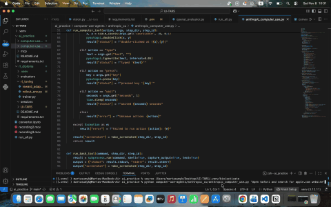

# Computer Use Agent (Anthropic, proprietary)

## Intro

The agent takes a  task description (e.g. “Open Safari and search for apple.com website")  
and autonomously performs (well, at least tries) the corresponding  actions on your screen.

Each step is recorded with:
- A screenshot
- The model response
- The tool invocation and results

The outputs are stored in the `anthropic_trajectories/` folder, creating a trace of the task execution.


## Setup

Install requirements: 

``` 
pip install -r requirements.txt 
```

Set your Anthropic API key:

```
export ANTHROPIC_API_KEY="your_api_key_here"
```

Run the task:

```
python computer-use-agents/anthropic_cu/anthropic_computer_use.py task_description
```

For example:

```
python computer-use-agents/anthropic_cu/anthropic_computer_use.py “Open Safari and search for apple.com website"
```

## Recording


Task: Open Safari and search for apple.com website.

